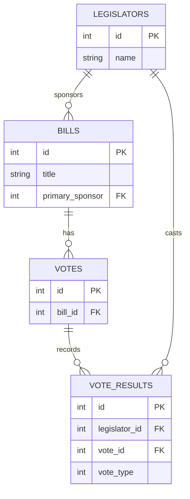
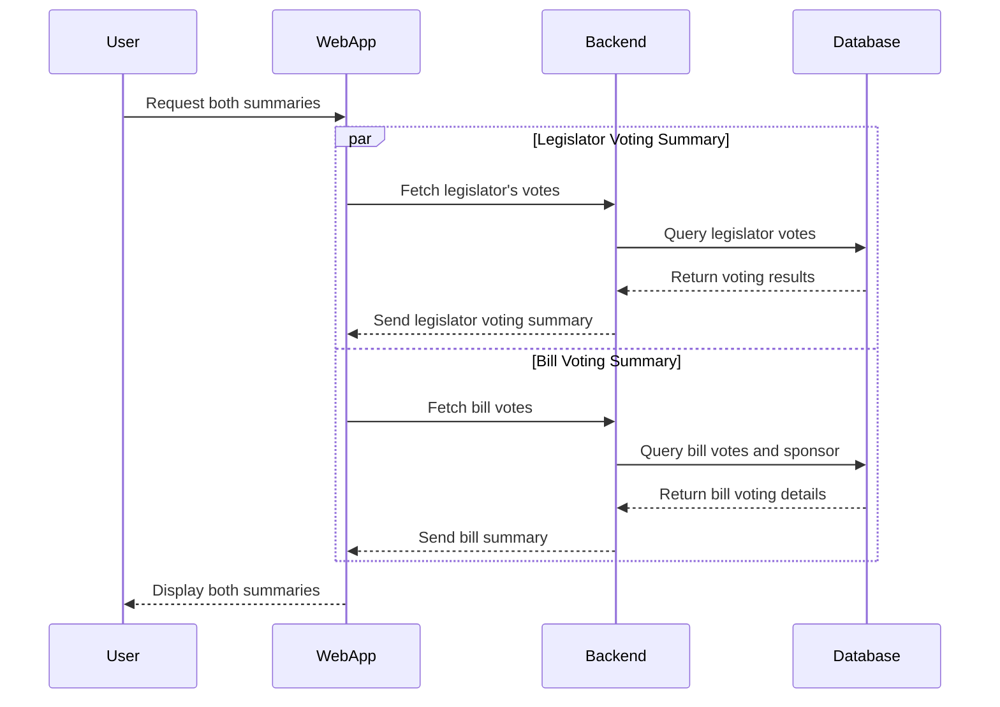

# Quorum Legislative Data Challenge

This project is a **full-stack web application** built with **React (Vite) for the frontend** and **Express.js for the backend**. The goal is to process and display legislative data from CSV files, answering key questions about bills and legislators.

## Entity relationships 

## Sequence diagram

