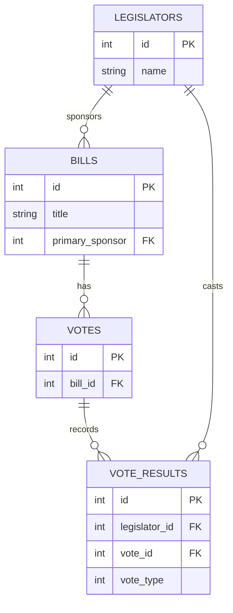
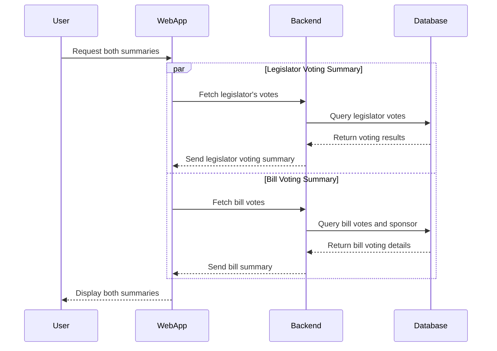

# Quorum Legislative Data Challenge

This project is a **full-stack web application** built with **React (using Vite) for the frontend** and **Express.js for the backend**. The goal is to process and display legislative data from CSV files, answering key questions about bills and legislators.

## Table of Contents

- [Project Overview](#project-overview)
- [Features](#features)
- [Technologies Used](#technologies-used)
- [Setup and Installation](#setup-and-installation)
- [Usage](#usage)
- [Testing](#testing)
- [Entity Relationships](#entity-relationships)
- [Sequence Diagram](#sequence-diagram)
- [License](#license)

## Project Overview

The Quorum Legislative Data Challenge aims to provide users with insights into legislative activities by analyzing data from four CSV files:

- `bills.csv`: Contains information about bills.
- `legislators.csv`: Contains information about legislators.
- `votes.csv`: Contains information about votes associated with bills.
- `vote_results.csv`: Contains information about individual vote results by legislators.

The application addresses the following user stories:

1. For every legislator available, how many bills did the legislator support (voted for the bill)? How many bills did the legislator oppose?
2. For every bill available, how many legislators supported the bill? How many legislators opposed the bill? Who was the primary sponsor of the bill?

## Features

- **Legislator Insights**: View the number of bills each legislator has supported and opposed.
- **Bill Insights**: View the number of supporters and opposers for each bill, along with the primary sponsor.

## Technologies Used

- **Frontend**:
  - React
  - Vite
  - CSS Modules
  - Material-UI
- **Backend**:
  - Node.js
  - Express.js
- **Testing**:
  - Vitest
  - React Testing Library

## Setup and Installation

1. **Extract the Project Files**:

   After receiving the `.zip` file of the project, extract its contents to your desired directory.

2. **Install Dependencies**:

   Run the following command to install all dependencies for the root, backend, and frontend:

   ```bash
   npm run install:all
   ```

   This command utilizes the `install:all` script defined in the `package.json`, which installs dependencies in the root directory as well as in the `backend` and `frontend` directories.

3. **Running the Application**:

   Start both the backend and frontend servers concurrently by running:

   ```bash
   npm start
   ```

   This command uses the `start` script from the `package.json`, which employs `concurrently` to run both the backend and frontend development servers simultaneously.

   - The backend server will start on `http://localhost:3000`.
   - The frontend application will start on `http://localhost:5173`.

## Testing

To run the tests:

```bash
npm test
```

This command runs the `test` script defined in the `package.json`, which utilizes Vitest for testing.

## Entity Relationships



## Sequence Diagram



## License

This project is licensed under the MIT License. See the [LICENSE](LICENSE) file for details.
